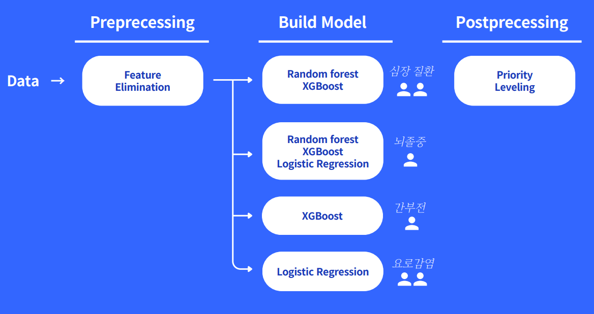

# KTAS system
1. [Purpose](#purpose)
2. [Develop setting](#develop-environment)
3. [Member](#member)
3. [License](#license)

## Purpose

## Develop Setting

### Environment
`Python 3.12`

### Architecture

## Member
- [강병오](https://github.com/kangG718)
- [성민지](https://github.com/minnji0)
- [양경식](https://github.com/gaeng02)
- [정윤서](https://github.com/jys0615)
- [조윤수](https://github.com/yoonsoo0313)
- [지가은](https://github.com/gaeunji)

## License

### Using Library (Refer to [NOTICE](./NOTICE))

| Library | Version | License | 
|---|:---:|:---|
| [`Pandas`](https://pandas.pydata.org) | 2.2.2 | `BSD 3-Clause` |
| [`Scikit-learn`](https://scikit-learn.org) | 1.5.1 | `new BSD` |
| `Xgboost` | 2.1.4 | `Apache-2.0` |
| [`Imbalanced-learn`](https://pypi.org/project/imbalanced-learn/) | 0.13.0 | `MIT` |
| [`Joblib`](https://joblib.readthedocs.io) | 1.4.2 | `BSD 3-Clause` |
